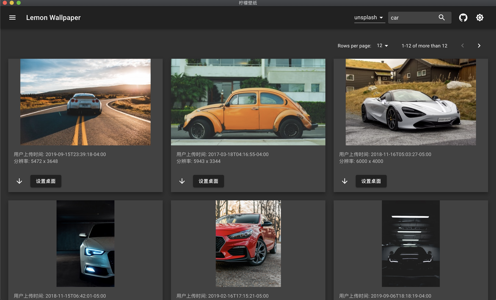
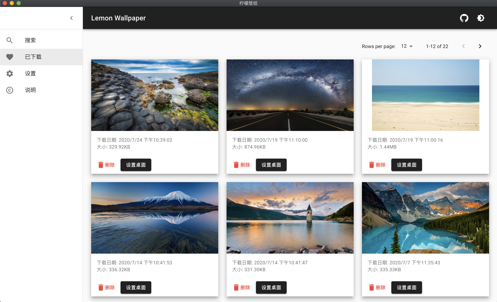

# 柠檬壁纸 APP
---

> 开发中

基于 `electron` + `react` 开发的客户端壁纸 app。

使用第三方图片数据源展示，提供下载与设置为桌面壁纸功能。

### 截图展示

### 开发模式

> 因全项目采用了 ts，所以在 electron 端需要 `watch`， 然后使用 `nodemon` 监听启动 electron。

1. yarn start
2. yarn electron-ts-watch 
3. yarn electron-dev-watch
   
### License

MIT